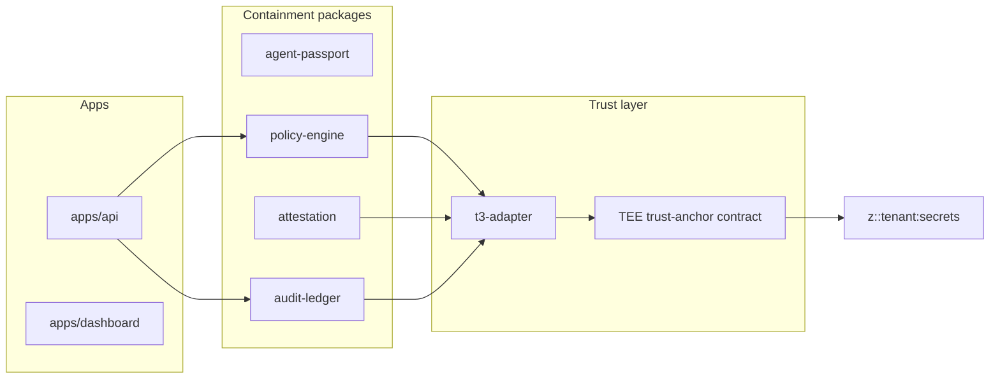

# T3 reuse map — Sovereign AI Containment Layer

This document records what was inspected in the reference project (`t3-compliance-gateway`), what was carried into `packages/t3-adapter/`, what was intentionally excluded, and how the new project stays clean.

**Reference project path:** `/Users/ramalingam/Projects/t3-compliance-gateway`  
**New project path:** `/Users/ramalingam/Projects/sovereign-ai-containment`

The reference project was **not modified** during this extraction.

---

## 1. Reuse report (inspection findings)

### 1.1 Existing T3 contract ID / contract address

| Field | Value |
|-------|-------|
| **T3N contract id** | `15` (testnet, from reference `.env`) |
| **Contract tail** | `compliance-gateway-v1` |
| **Contract version** | `0.1.0` |
| **Script name pattern** | `z:<tenantId>:compliance-gateway-v1` |
| **Ethereum address** | *None — T3N uses a numeric contract id, not an on-chain EVM address* |

Canonical reference copy in this repo: `configs/trust-anchor.reference.json`.

### 1.2 Existing T3 SDK / client files

| Reference path | Role |
|----------------|------|
| `src/t3/client.ts` | `T3nClient` + `TenantClient` session (handshake → SIWE → tenant DID) |
| `src/adapters/terminal3Adapter.ts` | Hackathon trust verification wrapper — **not reused** |
| `scripts/register-contract.ts` | CLI to register WASM and write `T3N_CONTRACT_ID` |
| `scripts/init-compliance.ts` | CLI to seed compliance keys into secrets map |

**SDK dependency:** `@terminal3/t3n-sdk` ^3.5.0

### 1.3 Existing ABI / interface files

T3N contracts use **WIT interfaces**, not JSON ABIs:

| Reference path | Role |
|----------------|------|
| `contracts/compliance-gateway/wit/world.wit` | World + exported `get-compliance-snapshot` |
| `contracts/compliance-gateway/wit/deps/host-tenant-1.0.0/package.wit` | Tenant context import |
| `contracts/compliance-gateway/wit/deps/host-interfaces-2.1.0/package.wit` | KV store + logging imports |
| `contracts/compliance-gateway/src/lib.rs` | WASM guest implementation |

These are **hackathon-specific contract logic** and were **not copied**. The adapter only needs SDK calls (`tenant.contracts.register`, `tenant.contracts.execute`).

### 1.4 Existing wallet / auth configuration

Auth is **API-key + SIWE** via the T3N SDK — no separate wallet config file:

```typescript
// Pattern from reference src/t3/client.ts
setEnvironment(environment);
const address = eth_get_address(apiKey);
const t3n = new T3nClient({
  wasmComponent: await loadWasmComponent(),
  handlers: { EthSign: metamask_sign(address, undefined, apiKey) },
});
await t3n.handshake();
await t3n.authenticate(createEthAuthInput(address));
```

Recreated in `packages/t3-adapter/src/client.ts` without changes to the auth flow.

### 1.5 Existing environment variables

| Variable | Reference usage | New project |
|----------|-----------------|-------------|
| `T3N_API_KEY` | Developer key | `configs/.env.example` |
| `T3N_ENVIRONMENT` | `testnet` \| `production` | `configs/.env.example` |
| `T3N_CONTRACT_ID` | Numeric trust-anchor id | `configs/.env.example` + `trust-anchor.reference.json` |
| `T3N_CONTRACT_TAIL` | Registration tail | Renamed default → `containment-trust-anchor-v1` |
| `T3N_CONTRACT_VERSION` | Semver at registration | `configs/.env.example` |
| `COMPLIANCE_POLICY_VERSION` | Hackathon default keys | **Not reused** |
| `COMPLIANCE_REGION` | Hackathon default keys | **Not reused** |
| `AUDIT_WEBHOOK_SECRET` | Hackathon sealed secret | **Not reused** |
| `GEMINI_API_KEY` | LLM + map fallback | **Not reused** |
| `MOCK_MODE`, sponsor API keys | Hackathon adapters | **Not reused** |

New additions: `T3N_CONTRACT_WASM_PATH`, `T3N_SECRETS_ENTRIES_JSON` (generic, not compliance-named).

### 1.6 Existing functions for reading / writing contract data

| Operation | Reference location | New adapter module |
|-----------|-------------------|-------------------|
| Session bootstrap | `src/t3/client.ts` → `getT3Session` | `client.ts` |
| Create secrets map + seal keys | `src/t3/complianceSecrets.ts` → `initializeComplianceSecrets` | `secretsMap.ts` → `initializeSecretsMap` |
| List sealed key names | `complianceSecrets.ts` → `listComplianceConfigKeys` | `secretsMap.ts` → `listSealedKeys` |
| Read map entry (control plane) | `src/t3/resolveSecret.ts` → `resolveSecretFromMaps` | `mapEntry.ts` → `readMapEntry` (no env fallback) |
| Execute TEE contract | `src/main.ts` → `tenant.contracts.execute` | `contractExecute.ts` → `executeContract` |
| Register TEE contract | `scripts/register-contract.ts` | `registerContract.ts` + `scripts/register-contract.ts` |

### 1.7 Existing audit / event logic

| Reference path | Role | Reused? |
|----------------|------|---------|
| `src/services/agentAuditLog.ts` | In-memory agent intake log | No — app-level, not T3 |
| `src/services/auditLog.ts` | Compliance check audit log | No |
| `src/services/telemetry.ts` | Analytics aggregation | No |
| `src/main.ts` `/api/v1/audit` | Invoice audit with T3 secrets for Gemini | No — hackathon scenario |
| `contracts/.../snapshot.rs` | TEE-derived compliance snapshot | No — old contract semantics |
| `src/services/t3GovernanceService.ts` | Mock/live governance proofs | No — scenario orchestration |

T3-related audit in the reference project was **application-layer** (hash payloads, mock proofs). True tamper-evident audit belongs in future `packages/audit-ledger/`, anchored by T3 attestations later.

### 1.8 Scenario-specific code — do not copy

| Category | Examples in reference project |
|----------|------------------------------|
| Hackathon agents | `src/agents/*`, `regulatedIntakeAgent`, `llmJudgeAgent`, `tokenRouterAgent` |
| Prompts | `src/prompts/*` |
| Sponsor adapters | `kimiAdapter`, `geminiAdapter`, `daytonaAdapter`, `nosanaAdapter`, etc. |
| Use cases | `src/usecases/finance.ts`, `procurement.ts`, `government.ts` |
| Policy / risk (demo) | `companyPolicy.ts`, `riskPolicy.ts`, `policyEngine.ts` (hackathon) |
| Express API surface | `src/main.ts` routes for intake, compliance check, audit |
| Public UI | `public/*` |
| WASM contract | `contracts/compliance-gateway/*` (compliance snapshot semantics) |
| Governance orchestration | `t3GovernanceService.ts`, `terminal3Adapter.ts` mock verify |

### 1.9 Minimum files required for T3 integration

**In the new project (`packages/t3-adapter/`):**

```
packages/t3-adapter/
├── package.json
├── tsconfig.json
├── README.md
├── src/
│   ├── index.ts
│   ├── types.ts
│   ├── config.ts
│   ├── client.ts
│   ├── secretsMap.ts
│   ├── mapEntry.ts
│   ├── contractExecute.ts
│   └── registerContract.ts
└── scripts/
    ├── register-contract.ts
    └── init-secrets-map.ts
```

**Plus root config:**

- `configs/.env.example`
- `configs/trust-anchor.reference.json`

**Not required for adapter-only phase:** WASM contract sources, Express app, agents, prompts.

### 1.10 Recommended folder structure

Implemented as specified:

```
sovereign-ai-containment/
├── apps/
│   ├── api/                 # scaffold
│   └── dashboard/           # scaffold
├── packages/
│   ├── t3-adapter/          # T3 integration (this phase)
│   ├── agent-passport/      # scaffold
│   ├── attestation/         # scaffold
│   ├── policy-engine/       # scaffold
│   ├── rag-firewall/        # scaffold
│   ├── memory-firewall/     # scaffold
│   ├── audit-ledger/        # scaffold
│   └── shared/              # scaffold
├── configs/
│   ├── .env.example
│   └── trust-anchor.reference.json
├── scenarios/               # scaffold
├── tests/                   # scaffold
└── docs/
    └── reuse-map.md         # this file
```

---

## 2. What was reused

| New file | Derived from | Changes |
|----------|--------------|---------|
| `client.ts` | `t3-compliance-gateway/src/t3/client.ts` | Same auth flow; exported as package API |
| `secretsMap.ts` | `complianceSecrets.ts` | Renamed functions; neutral messaging |
| `mapEntry.ts` | `resolveSecret.ts` | Removed `GEMINI_API_KEY` fallback |
| `config.ts` | `config.ts` | `T3AdapterConfig`; dropped `complianceDefaults` |
| `contractExecute.ts` | `main.ts` contract route | Extracted helper |
| `registerContract.ts` | `scripts/register-contract.ts` | Library function + thin CLI |
| `scripts/*` | reference scripts | Generic env vars and paths |

---

## 3. What was not reused — and why

| Excluded | Why |
|----------|-----|
| Hackathon agents, prompts, use cases | Business logic tied to demo scenarios |
| Sponsor tool adapters | Unrelated to T3 trust anchoring |
| `terminal3Adapter` / `t3GovernanceService` | Mock-verify and governance proofs are scenario glue |
| `compliance-gateway` WASM + WIT | Old contract semantics (`get-compliance-snapshot`, compliance keys) |
| Express `main.ts` routes | API belongs in future `apps/api` with containment domain model |
| In-memory audit logs | Future `audit-ledger` with proper persistence and T3 anchoring |
| `MOCK_MODE` and hackathon env vars | New project uses explicit `isT3Configured()` instead |
| Old naming (`compliance-gateway-v1`, `COMPLIANCE_*`) | Fresh trust-anchor naming for containment architecture |

---

## 4. How the new project stays clean

1. **Single integration boundary** — All T3 SDK usage lives in `@sovereign/t3-adapter`. Other packages depend on this adapter, not on `@terminal3/t3n-sdk` directly.
2. **No copied scenarios** — `scenarios/` is empty scaffold; reference demo flows stay in the old repo.
3. **Architecture-first placeholders** — Containment modules exist as named packages with README stubs, ready for independent implementation.
4. **Neutral configuration** — Env template uses containment-oriented defaults (`containment-trust-anchor-v1`), not hackathon compliance keys.
5. **Reference-only legacy anchor** — Legacy contract id `15` is documented in `configs/trust-anchor.reference.json`, not hard-coded in runtime code.
6. **Read-only reference** — The old project tree is untouched.

---

## 5. Where the old contract ID is referenced

| Location | Purpose |
|----------|---------|
| `configs/trust-anchor.reference.json` | Canonical documentation of legacy testnet anchor (`contractId: 15`) |
| `configs/.env.example` | Comment pointing operators to legacy id for migration context |
| `packages/t3-adapter/README.md` | Notes legacy tail `compliance-gateway-v1` vs new naming |

**Not referenced in runtime TypeScript** — no magic number `15` in adapter source. Operators set `T3N_CONTRACT_ID` in `configs/.env` when connecting to an existing or newly registered contract.

---

## 6. How the new project will use T3 as trust anchor (later phases)



Planned usage:

1. **Register** a containment-specific TEE contract (`containment-trust-anchor-v1`) via `register:contract`.
2. **Seal** policy roots, attestation keys, and audit signing material into `z::<tenant>:secrets` with ACL scoped to that contract id.
3. **Execute** trust-anchor functions inside the enclave for derived state (never raw secrets) via `executeContract`.
4. **Anchor** audit-ledger entries and attestations to T3-verifiable proofs produced by the contract + SDK session.

Phase 0 stops at a clean adapter and monorepo scaffold; containment modules wire in during subsequent phases.

---

## 7. Quick start (phase 0)

```bash
cd sovereign-ai-containment
npm install
npm run typecheck -w @sovereign/t3-adapter
cp configs/.env.example configs/.env
# Set T3N_API_KEY; optionally T3N_CONTRACT_ID=15 to reuse legacy testnet anchor
```
